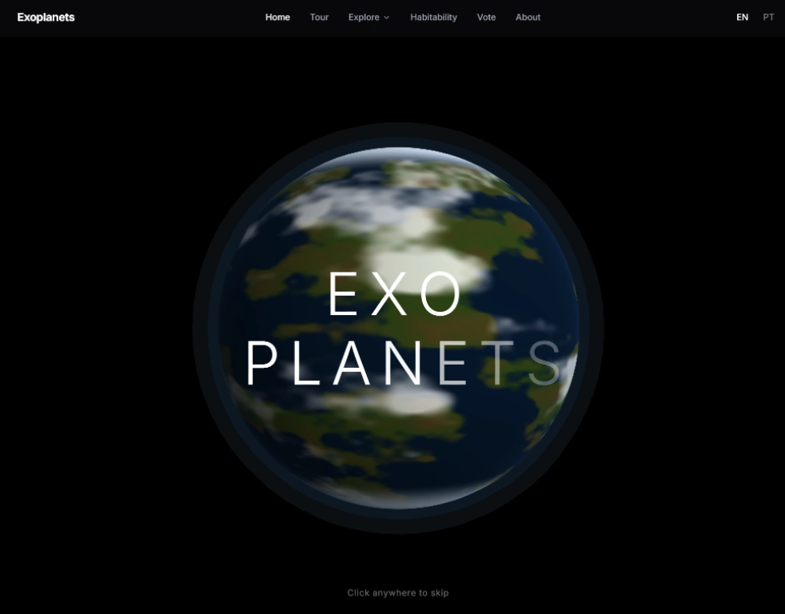

# Exoplanets 🌌

> This is my love letter to space exploration 🚀

<div align="center">

<a href="http://www.youtube.com/watch?v=vhRGp0q6VvQ" target="_blank" rel="noopener noreferrer">
  
</a>

</div>

An interactive web application for exploring NASA's confirmed exoplanet database, featuring 3D WebGL visualizations, data analysis, and discovery tools.

## Overview

**Exoplanets** brings the universe to your browser with:
- **6,000+ confirmed exoplanets** and **4,500+ host stars** from NASA's database
- **3D WebGL rendering** with custom shaders for planets and stars
- **Interactive data visualizations** powered by D3.js
- **Habitability analysis** with scoring algorithms
- **Star system orbital visualizations** in 3D space
- **Multi-language support** (English & Portuguese)

## Features

### 🪐 Planet Catalog
Browse and filter through 6,000+ confirmed exoplanets with advanced search capabilities:
- Multi-criteria filtering (type, size, temperature, habitability)
- Detailed planet pages with 3D visualizations
- Habitability scoring and analysis

### ⭐ Star Catalog
Explore 4,500+ host stars with detailed information:
- Star classification and properties
- Hosted planets overview
- 3D star surface shaders

### 🌍 Habitability Dashboard
Analytics dashboard featuring:
- D3.js charts and visualizations
- 3D spatial view of habitable planets
- Score distribution analysis
- Temperature and mass correlations

### 🎯 Star System Overview
Interactive 3D orbital visualizations:
- Real-time orbital mechanics
- Travel time calculations
- System-wide planet comparisons

### 🗳️ Vote for Earth 2.0
Community-driven voting on the most promising exoplanets for potential habitability.

### 📸 Astronomy Picture of the Day
Daily NASA APOD integration showcasing stunning space imagery.

## Tech Stack

- **Frontend**: React 18 + TypeScript
- **Build Tool**: Vite
- **3D Rendering**: Three.js + @react-three/fiber
- **Data Visualization**: D3.js
- **Styling**: Tailwind CSS
- **Routing**: React Router v6
- **i18n**: react-i18next (English + Portuguese)
- **Backend**: Firebase
- **Logging**: @guinetik/logger

## Getting Started

### Prerequisites

- Node.js 18+ and npm
- Python 3.8+ (for data pipeline)

### Installation

```bash
# Clone the repository
git clone https://github.com/yourusername/exoplanets.git
cd exoplanets

# Install dependencies
npm install

# Start development server
npm run dev
```

The application will be available at `http://localhost:5173`

### Available Scripts

```bash
npm run dev          # Start development server
npm run build        # Build for production
npm run preview      # Preview production build
npm test             # Run tests
npm run test:watch   # Run tests in watch mode
npm run lint         # Run ESLint
npm run format       # Format code with Prettier
npm run build:deploy # Build and deploy to GitHub Pages
```

## Project Structure

```
exoplanets/
├── src/              # Frontend source code
│   ├── components/   # Reusable React components
│   ├── routes/       # Page components (lazy-loaded)
│   ├── services/     # Singleton services (data, shaders, APOD)
│   ├── context/      # React Context providers
│   ├── utils/        # Utilities and helpers
│   │   └── math/     # Pure mathematical primitives
│   ├── types/        # TypeScript interfaces
│   ├── i18n/         # Translations
│   └── styles/       # Tailwind CSS styles
├── public/           # Static assets
│   ├── data/         # CSV data files
│   └── shaders/      # GLSL shader files
├── data/             # Data pipeline (Python)
│   ├── fetch_exoplanets.py    # NASA API fetcher
│   └── process_exoplanets.py  # Data transformer
└── docs/             # Project documentation
```

## Documentation

Comprehensive documentation is available in the [`docs/`](./docs/) directory:

- **[Architecture Overview](./docs/architecture-system-overview.md)** - System design and tech stack
- **[Component Hierarchy](./docs/architecture-component-hierarchy.md)** - React component structure
- **[Shader System](./docs/visualization-shader-system-v2.md)** - 3D rendering architecture
- **[Data Pipeline](./docs/data-processing-pipeline.md)** - Data transformation process
- **[API Documentation](./docs/api-data-service.md)** - Service layer reference

See the [docs README](./docs/README.md) for a complete index.

## Contributing

We welcome contributions! Please read our [Contributing Guidelines](./CONTRIBUTING.md) for:
- Code style guidelines
- Development setup
- Architecture principles
- Testing requirements

## Data Source

All exoplanet data is sourced from NASA's Exoplanet Archive API and processed through our custom pipeline. The data includes:
- 72 processed columns (derived from 683 NASA columns)
- Habitability calculations
- Orbital mechanics data
- Star system relationships

## License

MIT

## Links

- **Live Site**: [exoplanets.guinetik.com](https://exoplanets.guinetik.com)
- **Demo Video**: [YouTube](https://www.youtube.com/watch?v=vhRGp0q6VvQ)
- **Documentation**: [docs/](./docs/)

---

Built with ❤️ using React, Three.js, and D3.js
